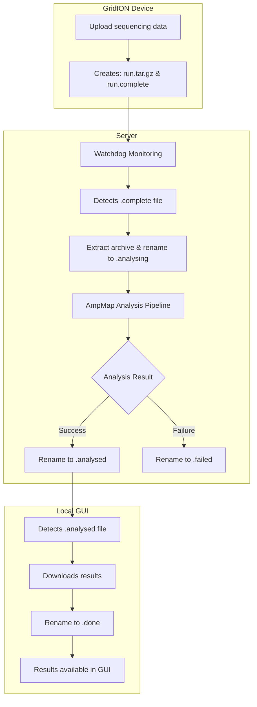

# AmpMap Watchdog

Automated file processing daemon for GridION uploads and AmpMap analysis.

## Overview

The watchdog monitors for new sequencing runs uploaded from GridION devices and automatically processes them through the AmpMap pipeline.

## Workflow


### Process Steps

1. **Upload Detection**: Monitors `/EBSDataDrive/ONT/Runs/` for `.complete` files
2. **File Processing**: 
   - Extracts corresponding `.tar.gz` archives
   - Changes status to `.analysing`
3. **Analysis**: Runs AmpMap pipeline automatically
4. **Status Updates**:
   - Success: `.analysing` → `.analysed` 
   - Failure: `.analysing` → `.failed`
5. **Download Ready**: GUI downloader detects `.analysed` files and changes to `.done` after download

## File States

- `.complete` - New upload ready for processing
- `.analysing` - Currently being processed
- `.analysed` - Analysis complete, ready for download
- `.failed` - Processing failed
- `.done` - Downloaded by GUI

## Usage

```bash
# Start watchdog
./ampmap_watchdog

# Check status
tail -f helper/watchdog.log
```

## Configuration

- **BASEDIR**: `/EBSDataDrive/ONT/Runs` - Monitor directory
- **ANALYSIS_SCRIPT**: `/EBSDataDrive/ONT/AmpMap/ampmap` - Pipeline script
- **Check Interval**: 30 minutes

## Requirements

- Docker (for AmpMap pipeline)
- Write permissions to BASEDIR
- AmpMap installation

## Troubleshooting
For issues, check `helper/watchdog.log` for detailed logs.